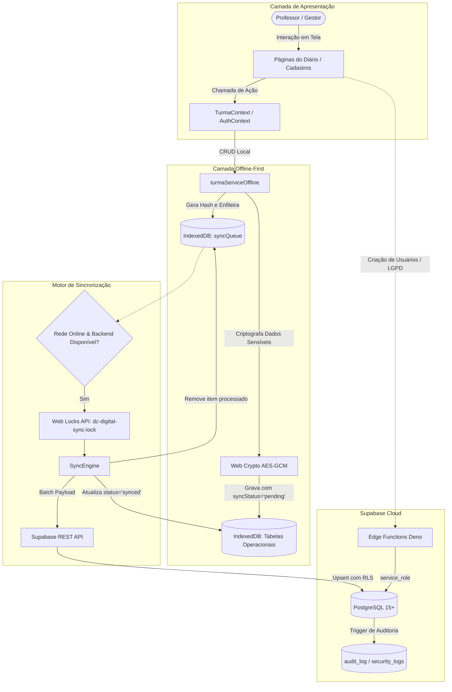

# DC-Digital — Documentação Técnica de Arquitetura

Este documento descreve a arquitetura técnica completa, padrões de engenharia, estrutura de dados e fluxos operacionais do sistema **DC-Digital**, baseando-se estritamente na implementação real do código-fonte.

---

## 1. Visão Geral

O **DC-Digital** é um sistema de gestão escolar e diário de classe digital projetado com foco em **alta disponibilidade**, **operação offline-first** e **conformidade com a LGPD (Lei Geral de Proteção de Dados)**. 

O sistema atende redes municipais e estaduais de ensino, permitindo que professores lancem frequências, conteúdos curriculares baseados na BNCC, avaliações e notas diretamente em sala de aula — mesmo em áreas sem conexão à internet. Quando a conectividade é restabelecida, o motor de sincronização em segundo plano despacha as mutações de forma determinística e segura para o backend Supabase.

---

## 2. Stack de Tecnologias

- **Linguagem**: TypeScript (~5.8.2) com tipagem estrita e JavaScript ESNext.
- **Frontend Core**: React 19.0.0 e React DOM 19.0.0.
- **Roteamento**: React Router DOM 7.18.2 (declarativo, rotas aninhadas, `ProtectedRoute`, Code Splitting via `React.lazy`).
- **Estilização**: Tailwind CSS 4.1.14 via `@tailwindcss/vite` e Vanilla CSS para tokens em `src/index.css`.
- **Ícones & Animações**: `lucide-react` (0.546.0) e `motion` (12.23.24).
- **Armazenamento Local (Client-Side)**: Dexie.js (4.4.2) e `dexie-react-hooks` (1.1.7) sobre IndexedDB.
- **Criptografia Local**: Web Crypto API nativa (`AES-GCM` 256 bits não-exportável, SHA-256).
- **Backend & Banco de Dados**: Supabase (PostgreSQL 15+, Supabase Auth via PKCE, Row Level Security, Triggers e Deno Edge Functions).
- **PWA & Service Worker**: `vite-plugin-pwa` (1.3.0) com Workbox (estratégias `StaleWhileRevalidate` e `CacheFirst`).
- **Telemetria & Monitoramento**: `@sentry/react` (10.67.0).
- **Bundler & Build Tool**: Vite 6.2.0 com chunk splitting manual no Rollup.
- **Qualidade & Testes**: ESLint 10, typescript-eslint 8, Vitest 4, Testing Library.

---

## 3. Estrutura de Pastas

```
DC Digital/
├── .agents/                      # Regras de engenharia e diretrizes de desenvolvimento
├── docs/                         # Documentação técnica e manuais de conformidade LGPD
│   ├── ARQUITETURA.md            # Este documento
│   ├── lgpd-implantacao.md
│   ├── lgpd-mapeamento-dados.md
│   └── lgpd-testes-manuais.md
├── public/                       # Manifest PWA, ícones, logos escolares, offline.html, ping.txt
├── scripts/                      # Scripts Node (updateLogos.js para sincronização de brasões)
├── supabase/
│   ├── functions/                # Deno Edge Functions (admin-create-user, lgpd-request)
│   ├── migrations/               # 12 Migrations SQL versionadas
│   └── config.toml               # Configuração da CLI do Supabase
├── src/
│   ├── __tests__/                # Testes unitários e de integração
│   ├── components/               # Componentes de UI, formulários e modais
│   │   ├── common/               # UI reutilizável (Toasts, ErrorBoundary, Loading, Modais)
│   │   ├── frequencia/           # Componentes de chamada e presença
│   │   └── portal/               # Componentes do Portal do Aluno (BoletimTab, etc.)
│   ├── config/                   # Configurações gerais e calendário letivo (appConfig.ts)
│   ├── constants/                # Constantes de autenticação, roles e status (authConstants.ts)
│   ├── contexts/                 # Providers de contexto (AuthContext, OfflineContext, TurmaContext)
│   ├── data/                     # Dados de contingência
│   ├── hooks/                    # Hooks reutilizáveis (useOnlineStatus, useSyncStatus, useTurmaProgress)
│   ├── lib/                      # Conexões centrais (crypto.ts, db.ts, supabase.ts)
│   ├── pages/                    # Páginas da aplicação
│   │   └── administracao/        # Abas de gestão (Escolas, Turmas, Professores, Alunos, Usuários, LGPD)
│   ├── services/                 # Regras de negócio, camada offline-first e sync
│   ├── types/                    # Tipos e interfaces TypeScript
│   └── utils/                    # Utilitários de data, timezone, rede e formatação
├── index.html                    # Ponto de entrada SPA e meta tags PWA
├── package.json                  # Manifesto de dependências e scripts
├── tsconfig.json                 # Configurações do compilador TypeScript
├── vercel.json                   # Cabeçalhos HTTP de segurança rigorosos (CSP, HSTS, CORS)
└── vite.config.ts                # Configuração do Vite, Workbox PWA e Rollup Chunks
```

---

## 4. Arquitetura Frontend

A aplicação é construída como uma **Single Page Application (SPA) progressiva (PWA)**, estruturada em camadas bem definidas:

1. **Camada de Apresentação (Views/Pages)**: Focada exclusivamente em renderizar a interface e capturar interações do usuário. Todas as páginas utilizam lazy loading (`React.lazy` com `<Suspense>`).
2. **Camada de Estado Global (Context Providers)**: Centraliza estados transversais (autenticação, turma ativa, status de rede/sincronização).
3. **Camada de Fachada Offline (`turmaServiceOffline`)**: Intercepta as operações CRUD da aplicação. Os componentes nunca chamam diretamente o Supabase para tarefas operacionais de diário.
4. **Camada de Resiliência e UI**: Controles de erro granulares via `ErrorBoundary` global e `RouteErrorBoundary` por página, evitando que falhas em um módulo quebrem a aplicação inteira.

---

## 5. Contextos (`src/contexts/`)

- **`AuthContext` (`AuthContext.tsx`)**:
  - Gerencia o ciclo de vida da sessão Supabase Auth com fluxo PKCE.
  - Extrai a role **exclusivamente do JWT assinado** (`session.user.app_metadata.role`).
  - Implementa logout seguro com verificação de dados locais pendentes e modal de confirmação.
  - Limpa chaves de criptografia e dados locais na troca de usuário.
- **`OfflineContext` (`OfflineContext.tsx`)**:
  - Monitora o estado de conectividade real através de polling e eventos do navegador.
  - Expõe métricas de sincronização: quantidade de itens pendentes, capacidade da fila, Dead Letter Queue e último sincronismo.
  - Dispara sincronização automática ao detectar restauração de rede.
  - Executa rotina de limpeza periódica de registros antigos sincronizados.
- **`TurmaContext` (`TurmaContext.tsx`)**:
  - Gerencia a turma ativa selecionada pelo docente.
  - Mantém o estado reativo de frequências, lançamentos de conteúdo, avaliações, notas e status de fechamento bimestral.
  - Fornece métodos assíncronos de salvamento (`salvarFrequencia`, `salvarConteudo`, `salvarAvaliacao`, `salvarNotas`, `salvarFechamento`).

---

## 6. Hooks (`src/hooks/`)

- **`useOnlineStatus`**: Combina o evento `window.navigator.onLine` com requisições periódicas ativas (ping) ao endpoint estático `/ping.txt` para validar se há tráfego real de internet.
- **`useSyncStatus`**: Assina os eventos do `syncEngine` para manter a UI informada sobre o progresso de sincronização em tempo real.
- **`useTurmaProgress`**: Calcula as métricas pedagógicas da turma no bimestre atual (taxa de presença, aulas dadas vs planejadas, avaliações criadas vs previstas).
- **`useCaptcha`**: Gera desafio matemático no cliente para proteção contra spam em formulários públicos.

---

## 7. Serviços (`src/services/`)

- **`turmaServiceOffline.ts`**: Fachada principal de operações de sala de aula. Redireciona leituras para cache local em caso de falha de rede e grava mutações no IndexedDB com enfileiramento imediato.
- **`turmaService.ts`**: Camada de integração remota direta com as tabelas do Supabase.
- **`offlineStorage.ts`**: Métodos CRUD tipados sobre o banco Dexie, criptografia/descriptografia de dados sensíveis e recuperação automática em caso de cota de disco excedida (`withQuotaRecovery`).
- **`offlineQueue.ts`**: Gerenciador transacional da fila persistente `syncQueue`, com controle de capacidade máxima (5.000 itens) e deduplicação por hash.
- **`syncEngine.ts`**: Motor de sincronização em segundo plano, controle de concorrência com Web Locks, resolução de dependências de IDs provisórios e retentativas com backoff exponencial.
- **`pendenciasService.ts`**: Análise e identificação de lacunas em diários (aulas sem chamada ou sem conteúdo).
- **`securityLogService.ts`**: Envio de eventos de auditoria e segurança.
- **`lgpdService.ts`**: Serviços de exportação de dados do titular e registro de consentimentos.

---

## 8. Supabase & Backend

O backend utiliza a infraestrutura gerenciada do Supabase:
- **PostgreSQL 15+** como banco relacional principal.
- **Supabase Auth** configurado com fluxo PKCE e armazenamento no `localStorage` para compatibilidade com links de recuperação de senha e abas múltiplas.
- **Supabase Storage** para armazenamento de fotos e logotipos escolares.
- **Edge Functions (Deno Runtime)** para execução de código com privilégios de `service_role`.

---

## 9. Banco de Dados (Schema Remoto)

### Tabelas Principais
1. **`escolas`**: Unidades escolares com INEP, diretor, distrito e logotipos.
2. **`usuarios`**: Perfis de acesso com vínculo de cargo e `escola_id`.
3. **`admin_whitelist`**: Lista de e-mails autorizados para promoção automática como `ADMIN`.
4. **`professores`**: Cadastro de docentes e componentes curriculares habilitados.
5. **`professor_alocacoes`**: Matriz de lotação de professores por escola, turno e turma.
6. **`professor_horarios`**: Grade horária semanal (dia da semana, ordem do tempo, componente).
7. **`turmas`**: Turmas cadastradas por escola e ano letivo.
8. **`alunos`**: Matrícula escolar, dados cadastrais e vínculo de turma.
9. **`frequencias`**: Registros diários de presença/falta por aluno, tempo e disciplina. Constraint de unicidade: `(turma_id, aluno_id, data, tempo, disciplina)`.
10. **`conteudos`**: Registros de aulas e habilidades BNCC. Constraint de unicidade: `(turma_id, data, tempo, disciplina)`.
11. **`avaliacoes`**: Instrumentos de avaliação (AV1, AV2, Recuperação) com suporte a auto-relacionamento (`parent_id`).
12. **`notas`**: Notas individuais por avaliação e aluno. Constraint de unicidade: `(avaliacao_id, aluno_id)`.
13. **`fechamentos_bimestres`**: Bloqueios formais de período. Constraint de unicidade: `(turma_id, disciplina, bimestre)`.
14. **`curriculo_unidades` / `curriculo_objetos` / `curriculo_habilidades`**: Matriz curricular BNCC.
15. **`audit_log` / `security_logs`**: Logs de alteração e trilhas de segurança com anonimização por hash SHA-256.
16. **`user_consents` / `lgpd_requests`**: Módulos de conformidade com a LGPD.

---

## 10. Políticas de Segurança (Row Level Security - RLS)

- **RLS Ativo** em 100% das tabelas do schema `public`.
- **Função de Segurança Definidora**: `get_user_role_secure()` obtém a role via JWT (`app_metadata->role`) ou tabela `usuarios`, sem fallbacks inseguros.
- **Isolamento por Escola**: Perfis `GESTOR` e `SECRETARIO` têm acesso restrito aos registros da sua própria escola vinculada (`escola_id`).
- **Isolamento Docente**: Professores acessam apenas alunos, turmas, avaliações e frequências das turmas onde possuem alocação confirmada.
- **Isolamento de Alunos**: Alunos têm acesso exclusivo aos seus próprios registros de notas e faltas.
- **Prevenção de Escalação de Privilégios**: Atualizações na coluna `cargo` da tabela `usuarios` são restritas a administradores através de policies de `WITH CHECK`.

---

## 11. Sistema de Autenticação

- **Mecanismo**: Supabase Auth PKCE.
- **Credenciais de Servidores**: E-mail institucional e senha (mínimo 8 caracteres, alfanumérico).
- **Credenciais de Estudantes**: Login via CPF com padrão de credencial virtual: `{cpf_numeros}@aluno.dcdigital.local`.
- **Prevenção contra Adulteração Local**: A role não é lida do banco local IndexedDB para autorização de rotas, impedindo escalação de privilégios via DevTools.

---

## 12. IndexedDB & Dexie.js (Schema Local)

O banco local `DCDigitalDB` é gerenciado via Dexie.js (versão 5) com as seguintes tabelas:

- `turmas`: `id, escola_id`
- `alunos`: `id, turma_id, syncStatus`
- `frequencias`: `++localId, [turma_id+aluno_id+data+tempo+disciplina], turma_id, syncStatus, updatedAt, [syncStatus+updatedAt]`
- `conteudos`: `++localId, [turma_id+data+tempo+disciplina], turma_id, syncStatus, updatedAt, [syncStatus+updatedAt]`
- `avaliacoes`: `++localId, turma_id, disciplina, syncStatus, id, updatedAt, [syncStatus+updatedAt]`
- `notas`: `++localId, avaliacao_id, [avaliacao_id+aluno_id], syncStatus, updatedAt, [syncStatus+updatedAt]`
- `horarios`: `++localId, turma_id`
- `fechamentos`: `++localId, [turma_id+disciplina+bimestre], syncStatus, [syncStatus+updatedAt]`
- `syncQueue`: `++id, table, status, createdAt, hash`
- `syncLogs`: `++id, timestamp, table, status`
- `cachedUsers`: `id`
- `files`: `++localId, syncStatus, relatedTable, relatedId`
- `userSalts`: `userId`

---

## 13. Arquitetura Offline-First

A operação offline segue o princípio de **autonomia local absoluta para a rotina diária**:

1. **Disponibilidade Imediata**: Toda mutação é gravada no IndexedDB antes de qualquer tentativa de rede.
2. **Feedback em Tempo Real**: A interface do professor atualiza instantaneamente (0ms de latência percebida).
3. **Persistência Segura**: Os dados permanecem gravados no dispositivo mesmo se o navegador for fechado ou o aparelho reiniciado.
4. **Recuperação de Cota**: Caso o limite de armazenamento local seja atingido, a função `withQuotaRecovery` purga dados já sincronizados antigos (>30 dias) para permitir novas gravações.

---

## 14. Fila de Sincronização (`SyncQueue`)

- **Estrutura**: Fila persistente no IndexedDB com ordenação FIFO por `createdAt`.
- **Deduplicação Inteligente**: Ao enfileirar uma operação com o mesmo hash de uma já existente com status `pending`, o payload é atualizado no mesmo registro.
- **Limite de Segurança**: Capacidade máxima fixada em 5.000 operações pendentes para evitar degradação de memória.
- **Dead Letter Queue (DLQ)**: Mutações com erros estruturais irrecuperáveis (ex: UUID inválido) são marcadas como `error` e isoladas para inspeção, impedindo o bloqueio do restante da fila.

---

## 15. Motor de Sincronização (`SyncEngine`)

- **Locking Concorrente Multi-Aba**: Utiliza a **Web Locks API** (`navigator.locks.request('dc-digital-sync-lock')`) para garantir que apenas uma aba processe a fila por vez.
- **Processamento em Lote (Batching)**: As chamadas de frequência e notas são agrupadas em arrays para execução em lote via `upsert`, minimizando overhead de rede.
- **Resolução de IDs Provisórios**:
  1. Avaliações criadas offline recebem um ID temporário (`clientTempId`).
  2. O `SyncEngine` sincroniza primeiro a avaliação e obtém o ID gerado pelo PostgreSQL.
  3. Em seguida, atualiza as notas dependentes que estavam referenciando o ID temporário antes de enviá-las ao banco.
- **Retentativas com Backoff Exponencial**: Intervalos incrementais calculados com jitter para evitar sobrecarga do servidor.

---

## 16. Tratamento de Conflitos

- **Estratégia**: *Last-Write-Wins* (LWW) baseado em carimbo `updatedAt`.
- **Constraints de Unicidade Remotas**: O PostgreSQL atua como autoridade final garantindo que inserções concorrentes sejam convertidas em atualização (`ON CONFLICT DO UPDATE`).
- **Deduplicação de Hashes**: A função `hashOperation` calcula o hash SHA-256 combinando a tabela, a operação e as chaves determinísticas do registro.

---

## 17. Criptografia e Privacidade Local (LGPD)

Implementada em `src/lib/crypto.ts`:
- **Algoritmo**: `AES-GCM` com chaves simétricas de 256 bits.
- **Chaves Não-Exportáveis**: Geradas via `crypto.subtle.generateKey` com flag `extractable: false`, persistidas no IndexedDB por usuário (`userSalts`).
- **Campos Protegidos**: Dados identificáveis de menores de idade (`nome`, `cpf`) são criptografados antes de serem gravados no cache local do IndexedDB.
- **Prefixo de Versionamento**: Formato determinístico `enc:v1:<base64(iv + ciphertext)>` para diferenciar dados cifrados de texto plano.
- **Limpeza de Sessão**: A chave em memória é purgada no logout através de `clearKeyCache()`.

---

## 18. Progressive Web App (PWA)

Configurado em `vite.config.ts` via `vite-plugin-pwa`:
- **Workbox Precaching**: Cache estático de HTML, CSS, JavaScript, WebFonts e imagens institucionais.
- **Estratégias de Cache em Runtime**:
  - `StaleWhileRevalidate` para assets de aplicação e folhas de estilo do Google Fonts.
  - `CacheFirst` para fontes estáticas e imagens com validade de até 1 ano.
- **Exclusões Críticas**: `/ping.txt`, rotas `/auth/*` e `/rest/v1/*` nunca são interceptadas pelo cache do Service Worker.
- **Notificação de Atualização**: O componente `SWUpdatePrompt` avisa o usuário quando uma nova versão do sistema é disponibilizada.

---

## 19. Edge Functions (Deno Runtime)

1. **`admin-create-user`**:
   - Criação segura de contas de usuários (`ADMIN`, `GESTOR`, `SECRETARIO`, `PROFESSOR`, `ALUNO`) via `service_role`.
   - Valida JWT do solicitante, permissões hierárquicas e vínculo escolar.
   - Aplica rate limit em memória (10 req/min) e exige senha forte (mínimo 8 caracteres, letras e números).
2. **`lgpd-request`**:
   - Recebimento público de pedidos de titulares (acesso, exclusão, retificação de dados).
   - Rate limit por IP (5 requisições a cada 15 minutos).
   - Gravação protegida na tabela `lgpd_requests` sem exposição de credenciais no frontend.

---

## 20. Fluxo Geral de Dados



---

## 21. Módulos Escolares Existentes

1. **Diário de Classe & Calendário Letivo**: Navegação por bimestres, acompanhamento de dias letivos e validação de pré-requisitos de fechamento.
2. **Frequência Escolar**: Lançamento de presenças, faltas simples, faltas justificadas e participação em aula.
3. **Planejamento Curricular (BNCC)**: Registro de conteúdos de aula vinculados a habilidades e objetos de conhecimento da matriz curricular.
4. **Avaliações & Notas**: Gestão de avaliações contínuas, cálculo de soma parcial e recuperação paralela com vinculação hierárquica.
5. **Aparata & Fechamento Bimestral**: Encerramento formal do período letivo com bloqueio de edições posteriores.
6. **Relatórios Gerenciais**:
   - Relatório de Notas por Avaliação
   - Relatório de Médias Bimestrais e Finais
   - Relatório de Conteúdos Ministrados
   - Relatório de Frequência e Infrequência Escolar
7. **Auditoria de Pendências**: Telas de diagnóstico para localização rápida de aulas sem chamada ou sem registro de conteúdo.
8. **Portal do Aluno**: Interface de consulta para estudantes visualizarem faltas, notas e boletim escolar.
9. **Painel Administrativo**: Gestão de Escolas, Turmas, Professores, Alunos, Usuários e Solicitações LGPD.

---

## 22. Rotas da Aplicação

| Rota | Componente | Papéis Permitidos | Finalidade |
| :--- | :--- | :--- | :--- |
| `/` | `Login` | Visitantes | Autenticação no sistema |
| `/recuperar-senha` | `RecuperarSenha` | Visitantes | Solicitação de redefinição de senha |
| `/redefinir-senha` | `RedefinirSenha` | Visitantes | Cadastro de nova senha com token |
| `/politica-de-privacidade` | `PoliticaPrivacidade` | Público | Termos de privacidade LGPD |
| `/termos-de-uso` | `TermosUso` | Público | Termos de uso do sistema |
| `/solicitacao-lgpd` | `SolicitacaoLgpd` | Público | Canal de direitos do titular de dados |
| `/minha-privacidade` | `MinhaPrivacidade` | Todos Logados | Gestão de consentimentos do usuário |
| `/portal-aluno` | `PortalAluno` | `ALUNO` | Painel de notas, faltas e boletim |
| `/turmas` | `Turmas` | `STAFF_ROLES` | Seleção de turmas do professor |
| `/diario` | `Diario` | `STAFF_ROLES` | Calendário e lançamentos da turma |
| `/frequencia` | `Frequencia` | `STAFF_ROLES` | Lançamento de presenças e faltas |
| `/relatorio-notas` | `RelatorioNotas` | `STAFF_ROLES` | Mapa de notas por avaliação |
| `/relatorio-medias` | `RelatorioMedias` | `STAFF_ROLES` | Médias bimestrais e finais |
| `/relatorio-conteudos`| `RelatorioConteudos`| `STAFF_ROLES` | Histórico de conteúdos lecionados |
| `/relatorio-frequencia`| `RelatorioFrequencia`| `STAFF_ROLES` | Relatório de frequência e evasão |
| `/estatisticas` | `Estatisticas` | `STAFF_ROLES` | Indicadores de desempenho |
| `/pendencias-lancamento`| `PendenciasLancamento`| `STAFF_ROLES` | Aulas com pendência de conteúdo |
| `/pendencias-frequencia`| `PendenciasFrequencia`| `STAFF_ROLES` | Aulas com pendência de frequência |
| `/aparata` | `Aparata` | `STAFF_ROLES` | Status de fechamento da turma |
| `/aparata-detalhes` | `AparataDetalhes` | `STAFF_ROLES` | Fechamento formal do diário |
| `/administracao` | `Administracao` | `ADMIN_ROLES` | Cadastros administrativos |
| `/curriculo` | `Curriculo` | `ADMIN_ROLES` | Matriz curricular e habilidades BNCC |

---

## 23. Perfis e Permissões

- **`ADMIN`**: Acesso irrestrito a todas as escolas, turmas, configurações globais, matriz curricular e gestão de usuários.
- **`GESTOR`**: Gestão administrativa e pedagógica no âmbito da sua escola vinculada.
- **`SECRETARIO`**: Gestão de matrículas, turmas e registros escolares no âmbito da sua escola vinculada.
- **`PROFESSOR`**: Acesso restrito aos diários, frequências, conteúdos e notas das turmas sob sua regência.
- **`ALUNO`**: Acesso somente-leitura aos seus próprios dados escolares no Portal do Aluno.

---

## 24. Processo de Build e Deploy

1. **Pré-Build**: Script `node scripts/updateLogos.js` para download e sincronização dos brasões das escolas em `public/`.
2. **Compilação**: `vite build` executa o empacotamento Rollup com chunks segmentados:
   - `vendor-react` (React, React-DOM, React-Router)
   - `vendor-supabase` (Supabase Client)
   - `vendor-sentry` (Sentry SDK)
   - `vendor-motion` (Motion)
   - `vendor-dexie` (Dexie.js)
   - `vendor-icons` (Lucide React)
3. **Deploy (Vercel)**:
   - Configuração de cabeçalhos de segurança via `vercel.json` (CSP, HSTS, X-Frame-Options `DENY`, X-Content-Type-Options `nosniff`, Permissions-Policy).
   - Regras de reescrita SPA garantindo roteamento direto para `/index.html`.

---

## 25. Pontos Críticos de Atenção

1. **Integridade da `syncQueue`**: Nunca alterar o schema ou a lógica de hashing da fila sem rotinas de migração compatíveis, sob risco de perda de lançamentos de professores offline.
2. **Resolução de Chaves Temporárias**: O mapeamento entre `clientTempId` de avaliações e notas dependentes deve ser preservado rigorosamente no motor de sincronização.
3. **Segurança de Roles**: Jamais confiar na role armazenada no cache local IndexedDB para autorizar operações críticas.
4. **Isolamento Multi-Aba**: Manter o lock via Web Locks API ativo para evitar escritas concorrentes na API remota.

---

## 26. Dívidas Técnicas Identificadas

1. **Monolitos de Apresentação**: Componentes de relatórios extensos (`RelatorioNotas.tsx`, `TabAlunos.tsx`) concentrando regras de negócio e renderização em um único arquivo.
2. **Padronização de Datas**: Uso simultâneo de múltiplos formatos de string de data que demandam centralização estrita no utilitário de datas.
3. **Cobertura de Testes**: Ampliação dos testes automatizados para cobrir cenários ponta a ponta de simulação de queda e retorno de rede.

---

## 27. Roadmap Técnico Sugerido

### Fase 1: Padronização de Documentos Oficiais
- Implementação de motor de renderização PDF vetorial para Boletins Escolares, Fichas Individuais e Diários Oficiais de Classe.
- Fluxo padronizado de Conselho de Classe e Recuperação Final Anual na Aparata.

### Fase 2: Gestão Pedagógica Avançada
- Módulo de ocorrências pedagógicas e comportamentais individuais do aluno.
- Painel analítico de infrequência e alerta precoce de evasão escolar para a gestão.

### Fase 3: Portal do Responsável & Comunicação
- Extensão do Portal do Aluno para acesso dos responsáveis com acompanhamento de presença diária.
- Canal institucional de avisos e notificações da escola.

### Fase 4: Otimização e Escalabilidade
- Refatoração e modularização dos componentes extensos de relatórios.
- Suíte completa de testes de integração offline/online com Vitest.